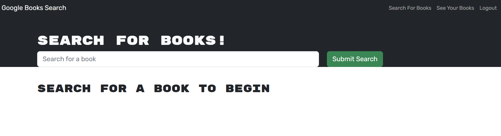
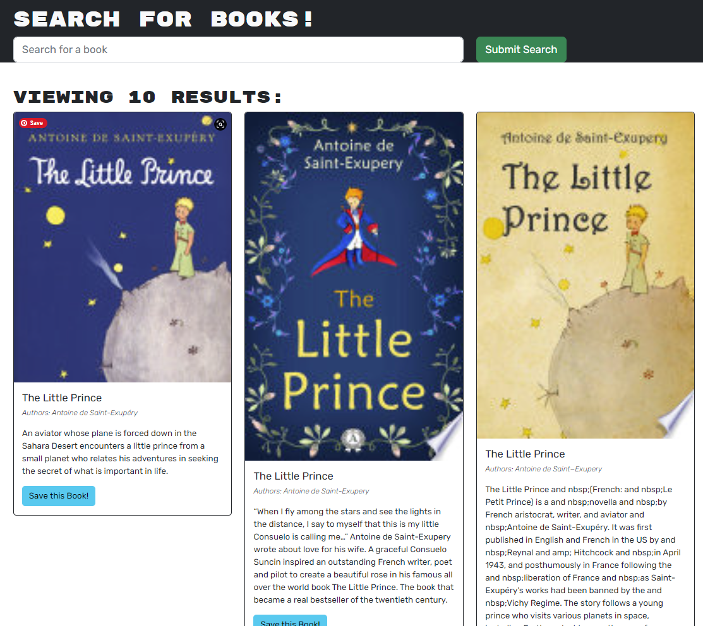
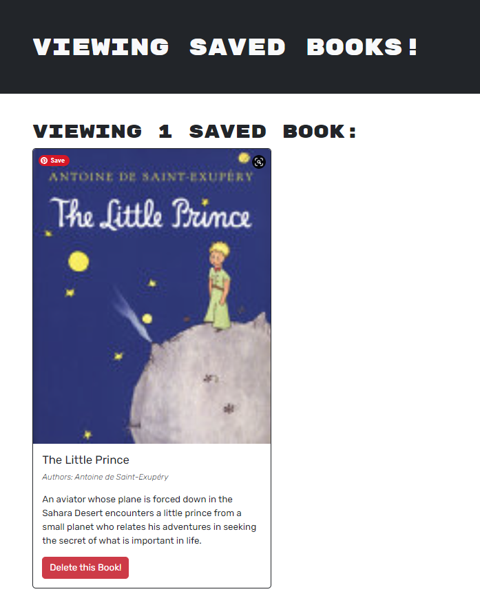

# MERN Book Search Engine

## Description

The aim of this project was to refactor a functioning Google Books API search engine for it to be a GraphQL API built with Apollo Server instead of a RESTful API. To use this search engine, a user can sign up or log in, search for books, save and delete them. Working on this project helped me gaining further understanding in how to set up an Apollo Server to use GraphQL queries and mutations to fetch and modify data, and how to modify and replace RESTful API with GraphQL API

## Installation

To create this app, @apollo/client, apollo-server-express, and graphql packages were installed.

## Usage

A user can sign up with their username, email and password, and log in with email and password. After logging in a user will be able to search for books, save the ones they like, and delete them from their list, if needed. A user can also search for books without logging in, but they will not be able to save the books that they liked.  
[Book Search Engine App](https://mern-book-search2303.herokuapp.com/)  
  
  

## Credits

Luba Mintsys. https://github.com/lmintsys

## License

MIT License

Copyright (c) 2023 lmintsys

Permission is hereby granted, free of charge, to any person obtaining a copy
of this software and associated documentation files (the "Software"), to deal
in the Software without restriction, including without limitation the rights
to use, copy, modify, merge, publish, distribute, sublicense, and/or sell
copies of the Software, and to permit persons to whom the Software is
furnished to do so, subject to the following conditions:

The above copyright notice and this permission notice shall be included in all
copies or substantial portions of the Software.

THE SOFTWARE IS PROVIDED "AS IS", WITHOUT WARRANTY OF ANY KIND, EXPRESS OR
IMPLIED, INCLUDING BUT NOT LIMITED TO THE WARRANTIES OF MERCHANTABILITY,
FITNESS FOR A PARTICULAR PURPOSE AND NONINFRINGEMENT. IN NO EVENT SHALL THE
AUTHORS OR COPYRIGHT HOLDERS BE LIABLE FOR ANY CLAIM, DAMAGES OR OTHER
LIABILITY, WHETHER IN AN ACTION OF CONTRACT, TORT OR OTHERWISE, ARISING FROM,
OUT OF OR IN CONNECTION WITH THE SOFTWARE OR THE USE OR OTHER DEALINGS IN THE
SOFTWARE.
